<div align="center">


# Auto Style

**A bilingual (French / Arabic) e-commerce store and admin dashboard for premium car accessories in Algeria. Customers pay cash on delivery, with delivery to all 69 wilayas.**

[**auto-style.shop**](https://auto-style.shop)


</div>

---

## Overview

Auto Style is a production storefront built for the way Algerians shop online. There is no payment gateway and no customer account. A customer picks a product, enters a name, phone number, wilaya and commune, and pays the courier on delivery. The site is built around that flow. Every product page has an order form, so a customer can order in a single screen.

The store owner runs everything from a private admin dashboard: products, categories, orders, per-wilaya delivery rates and customer reviews. The dashboard needs no developer.

## Design

The visual idea is **a racing garage at night**.

- **Dark, high-contrast base** with one accent colour, a crimson red (`#E11D2A`), taken from the brand's logo. Red marks only prices, calls to action and live state, so the eye goes straight to what matters.
- **Motorsport motifs**: an animated racing track that winds behind the page sections, checkered-flag section labels, speedometer-style stat gauges and a steering-wheel "order now" control.
- **An illustrated hero car** with floating product cards that tilt in 3D. It gives the landing page personality without loading a heavy 3D engine.
- **Bento-grid panels** with large rounded corners. The same component system is used on the storefront and in the dashboard.
- **Condensed display type**: *Rajdhani* for Latin text and *IBM Plex Sans Arabic* for Arabic, which keeps both scripts equally sharp.
- **A true bilingual layout.** Arabic is not a translated overlay. The whole interface mirrors to right-to-left, including navigation, forms, price alignment and icon direction.
- **Light and dark themes**, each with its own colour tokens. The car illustration and track are recoloured for each theme.

Animations move elements by position only. Visibility is never gated on a JavaScript fade. If an animation cannot run on a slow phone, the content is still there, and users who set *reduced motion* get a calm, static page.

## Screenshots

### Desktop

| Home (dark) | Home (Arabic, RTL) |
|---|---|
| 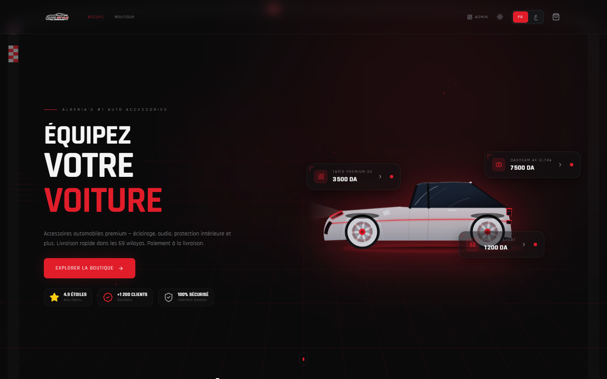 | 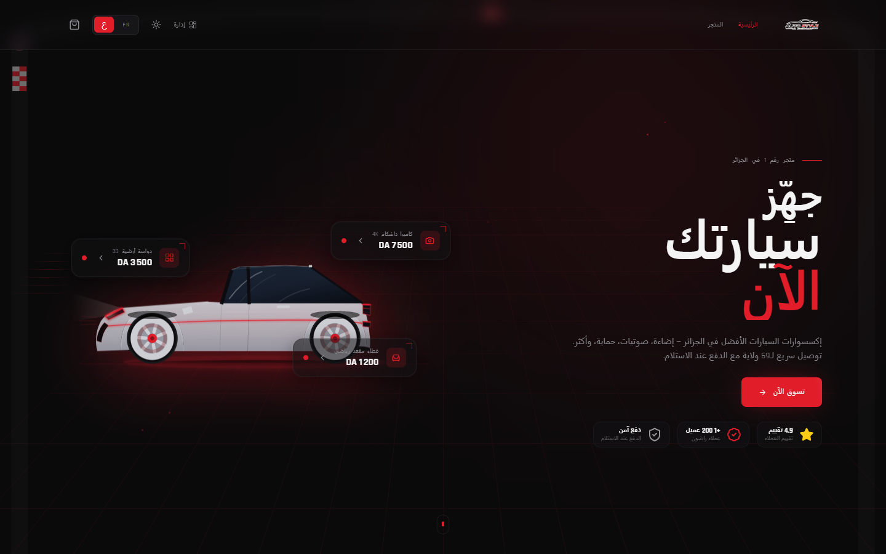 |
| **Home (light)** | **How it works** |
| 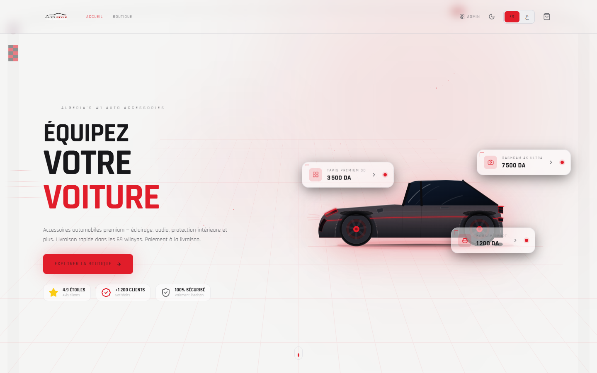 | 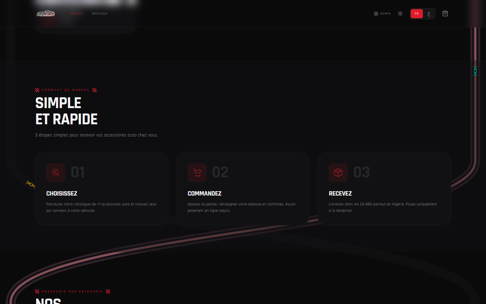 |
| **Shop** | **Product** |
| 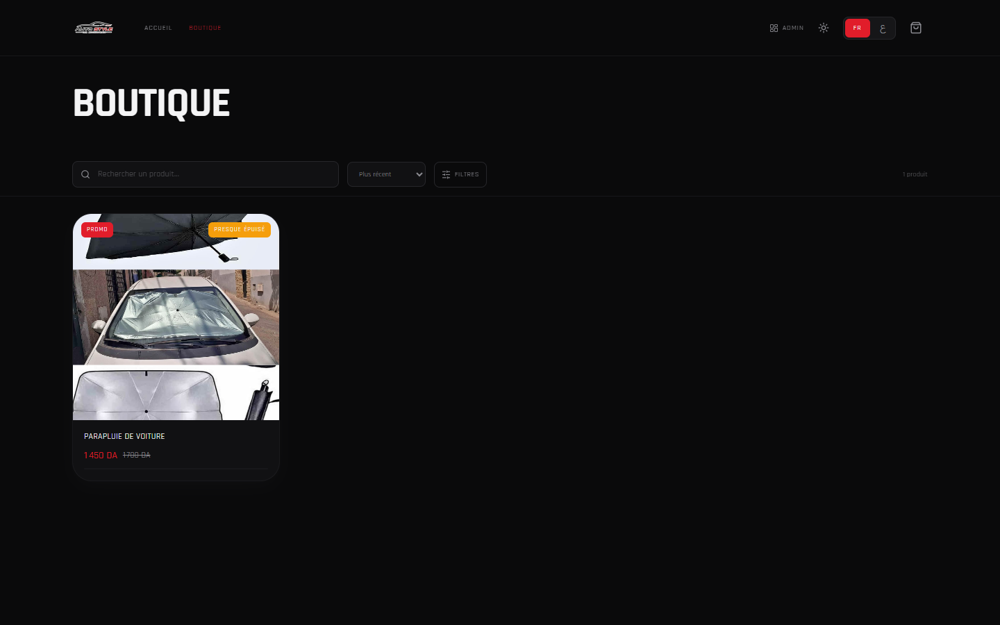 | 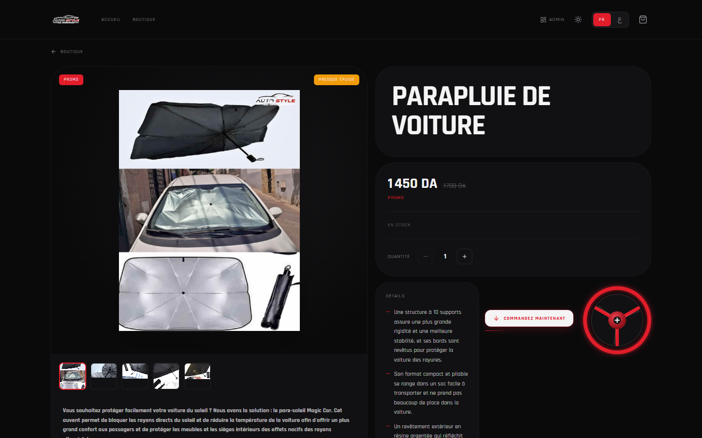 |

<p align="center"><b>Order form</b> (delivery price updates live per wilaya and delivery type)</p>

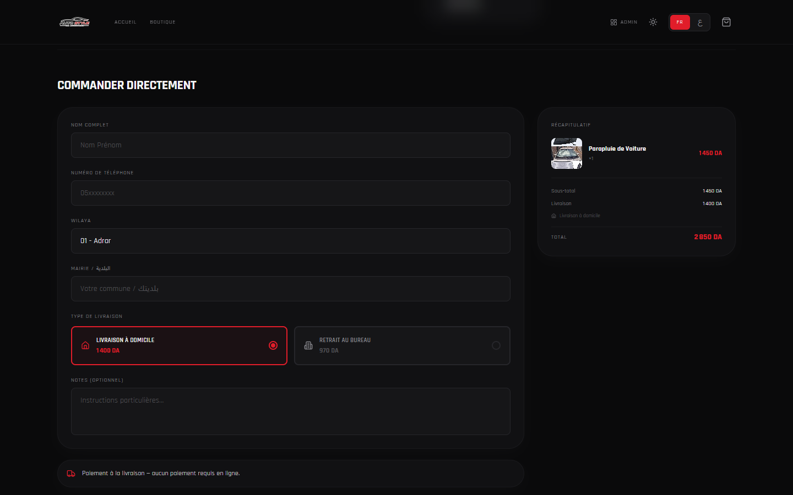

### Mobile

<p align="center">
  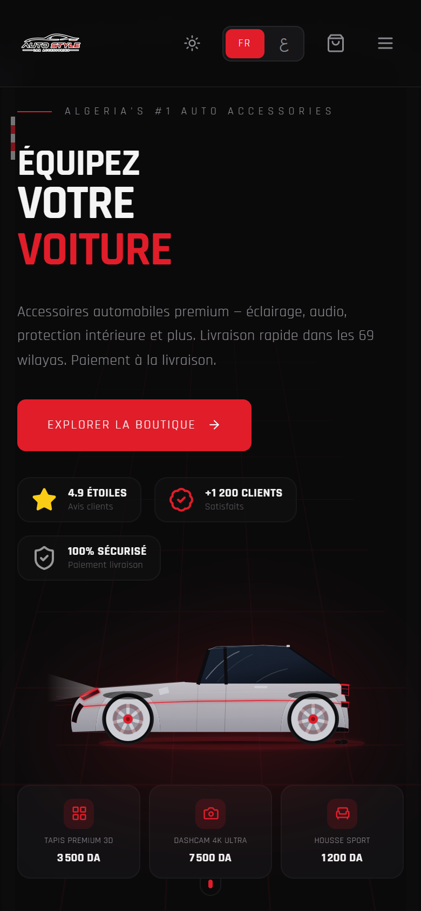
  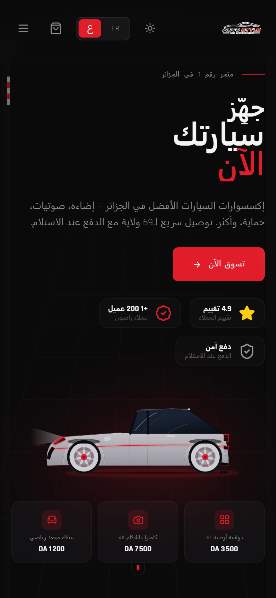
  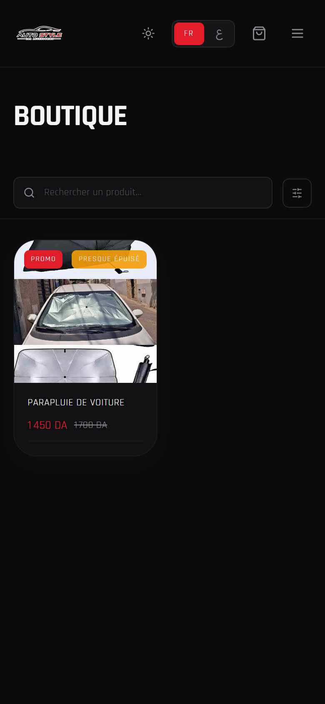
</p>
<p align="center">
  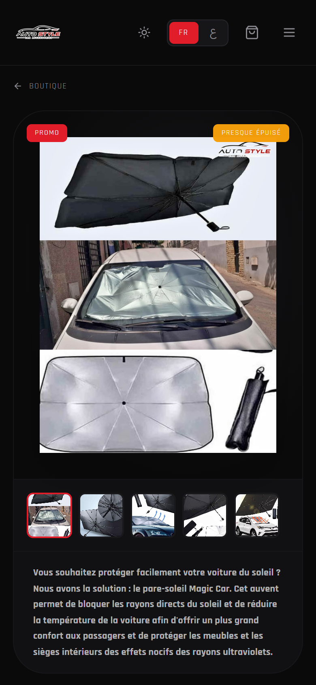
  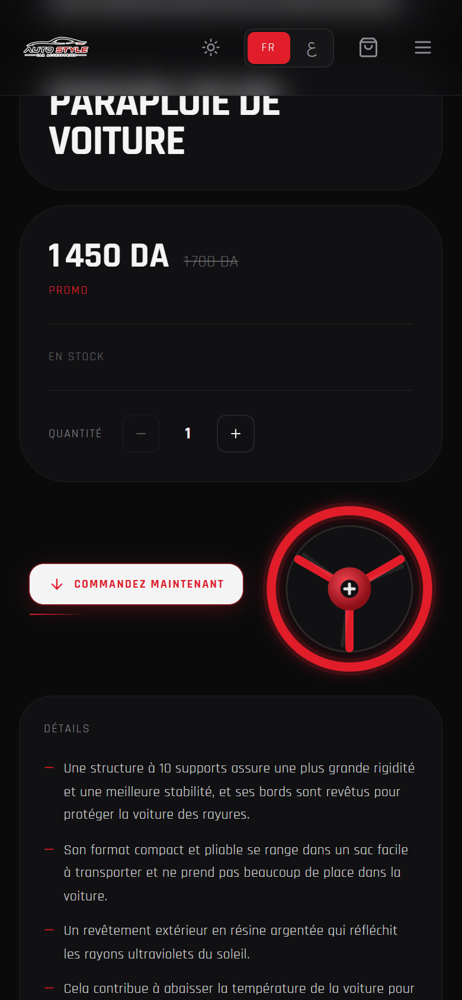
  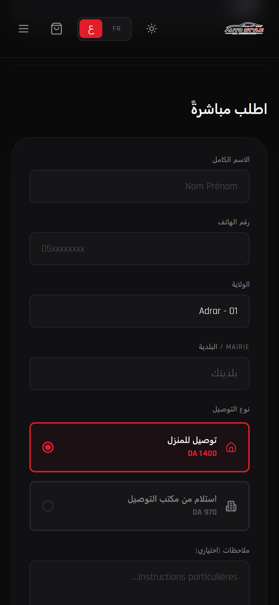
</p>

## Features

### Storefront

- Landing page with hero, live product stats, featured products, category browser, how-it-works steps and customer reviews
- Shop with text search, category filters and sorting
- Product pages with an image gallery, an optional looping product video, colour and size options, promo pricing, and *In stock* / *Almost sold out* badges
- **One-page ordering**: an order form on every product page, plus a cart drawer and a full checkout for multi-item orders
- Delivery price per wilaya, with **home delivery** or **courier-office pickup**. Wilayas the store does not serve are hidden automatically.
- Order confirmation page that looks up the order by its public order number
- French and Arabic, with full RTL mirroring. Language and theme choices persist between visits.

### Admin dashboard (`/admin`)

- **Overview**: total orders, revenue, active products, low-stock alerts and recent orders
- **Products**: create and edit products (FR/AR names and descriptions, pricing, compare-at price, stock, colours, sizes, draft/active status, *almost sold out* flag), image uploads with in-browser compression and ordering, and video upload or linking
- **Categories**: bilingual category management
- **Orders**: order list and detail view, with the lifecycle *pending → confirmed → shipped → delivered / cancelled*
- **Delivery prices**: home and office rates for all 69 wilayas, plus a per-wilaya on/off switch
- **Reviews**: manage the testimonials shown on the home page, with star rating and optional photo
- Light and dark themes, in French and Arabic like the storefront

## Tech stack

| Layer | Technology |
|---|---|
| Runtime & package manager | [Bun](https://bun.sh) |
| Framework | React 18 + TypeScript (strict mode) |
| Build tool | Vite 6 |
| Styling | Tailwind CSS with CSS-variable design tokens (light/dark) |
| Animation | Framer Motion |
| Routing | React Router 6 |
| Server state | TanStack Query 5 |
| Client state | Zustand (persisted cart) |
| Forms & validation | React Hook Form + Zod |
| Icons | Lucide |
| Backend | Supabase: PostgreSQL, Row-Level Security, Auth, Storage, RPC functions |
| Video hosting | Cloudinary |
| Hosting | Vercel (static SPA + Edge Middleware) |
| Analytics | Meta Pixel (SPA-aware event tracking) |

## Security

- **Server-side pricing.** Orders go through one `SECURITY DEFINER` Postgres function, `place_order`. It ignores any price sent by the browser and recalculates every line item, discount and delivery fee from the database. A tampered client cannot change what an order costs.
- **Server-side order validation.** The same function rejects empty carts, invalid quantities, orders that would oversell stock, and deliveries to disabled wilayas. It returns stable error codes, which the UI shows as translated messages.
- **Row-Level Security** on every table. Anonymous visitors can only read active products, categories, reviews and delivery rates. They can create orders only through the RPC and read an order only by its order number. Admin writes require an authenticated session, and public sign-up is disabled.
- **Scoped storage policies.** Anyone can read product images. Only an authenticated admin can upload or delete them.
- **Input hardening.** Shop search input is sanitised before it reaches the PostgREST filters, which prevents filter injection. All forms are validated with Zod on the client and again in SQL.
- **Spam protection.** A honeypot field on the order forms filters out bot submissions without a CAPTCHA.
- **HTTP security headers** (via `vercel.json`): HSTS with preload, `X-Content-Type-Options`, `X-Frame-Options`, `Referrer-Policy` and a restrictive `Permissions-Policy`.
- **No secrets in the client.** The browser only ever gets the Supabase *anon* key, and RLS governs what that key can do. Environment files are excluded from version control.

## Performance

- **Vendor code-splitting** into separate cached chunks (React, motion, query, Supabase, forms, icons), so a new release only invalidates the app's own code.
- **Immutable caching** of hashed assets for one year at the edge.
- **Client-side image compression** before upload. Phone photos of several MB are resized to at most 1600 px and re-encoded, so product images load fast on mobile data.
- **Lazy-loaded, async-decoded images** everywhere below the fold, with eager loading only for above-the-fold product cards.
- **Preconnect and DNS prefetch** to the database and font origins, and `font-display: swap`.
- **Lightweight animation**: GPU-friendly transform animations only, costly effects turned off on mobile, the racing-track loop paused when the tab is hidden, and full `prefers-reduced-motion` support.
- **Query caching** with TanStack Query, so moving between pages doesn't refetch data that's already loaded.

## SEO

- Full static meta tags in `index.html`: title, description, canonical URL, Open Graph and Twitter cards, with a 1200 × 630 share image
- **Per-page titles, descriptions, canonical URLs and OG tags** set on every route change
- **Structured data (JSON-LD)**: a site-wide `Store` schema, plus `Product` / `Offer` schema with price, currency and availability on every product page
- **Edge-rendered link previews.** Social crawlers such as Facebook, WhatsApp, Instagram and Telegram don't run JavaScript. A Vercel Edge Middleware serves them the real product title, description, price and image for each `/product/:slug` link, while real visitors go straight to the app.
- **Automatic sitemap**: `sitemap.xml` is regenerated from the live product catalogue on every build
- `robots.txt` keeps `/admin` and `/checkout` out of search indexes
- Arabic and French locale tags (`ar_DZ`, `fr_FR`) and semantic, accessible markup

## Project structure

```
├── middleware.ts          # Vercel Edge Middleware: product link previews for social crawlers
├── public/                # favicon, OG image, robots.txt, generated sitemap.xml
├── scripts/               # sitemap generator, OG image generator
├── supabase/migrations/   # ordered SQL: schema, RLS, RPC functions, seed data
└── src/
    ├── components/        # layout, product, UI primitives, hero effects
    ├── hooks/             # data fetching, SEO, auth, media queries, honeypot
    ├── i18n/              # FR/AR translations, RTL provider, wilaya list
    ├── lib/               # Supabase client, pixel, formatting, validation, image compression
    ├── pages/             # storefront pages + admin/ dashboard pages
    ├── store/             # Zustand cart store
    ├── theme/             # light/dark theme provider
    └── types/             # database types
```

## Local development

> Private project. These notes are for the owner and authorised collaborators.

**Requirements:** [Bun](https://bun.sh) 1.x and a Supabase project.

1. Install dependencies:
   ```bash
   bun install
   ```
2. Create a `.env` file at the project root:
   ```env
   VITE_SUPABASE_URL=
   VITE_SUPABASE_ANON_KEY=
   VITE_CLOUDINARY_CLOUD_NAME=
   VITE_CLOUDINARY_UPLOAD_PRESET=
   ```
3. Run the SQL files in `supabase/migrations/` in numerical order. Then create a public `product-images` storage bucket and an admin user in Supabase Auth.
4. Start the dev server:
   ```bash
   bun run dev
   ```

| Script | Purpose |
|---|---|
| `bun run dev` | Start the development server |
| `bun run build` | Regenerate the sitemap, type-check and build for production |
| `bun run preview` | Serve the production build locally |
| `bun run typecheck` | Run the TypeScript compiler without emitting |
| `bun run lint` | Lint the codebase |

## Author

Designed and developed by **Alaa Younsi**: design, frontend, backend, database, security, SEO and deployment.

## License

**Copyright © 2026 Alaa Younsi. All rights reserved.**

This is proprietary software. No part of this project may be copied, reused, modified, distributed or used to build another work without the author's prior written permission. See [LICENSE](LICENSE) for the full terms.
